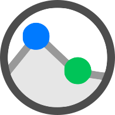

  

# Analitica Library

## Overview

Usefull library to manage both Google Analytics and Piwik services to match FOSS software need

## Detailed overview

When developing an application, expecially if you're a single developer or small development team, is extremelly important to have informations about how to improve your work for users. Having analytics informations helps you to decide what language to translate your app into, if supporting RTL languages is relevant and many more things.

However, if you decide to work on a completelly open-sourced stack you can't simply include an arbitrary closed-source analytics library and go on. 
To simplify this task *Analitica* offers to developers an helper to manage both [Google Analytics](https://www.google.it/intl/it/analytics/) and [Piwik](https://piwik.org/) third-party libraries gaving you the opportunity to include just one of them or both managing dependencies in a Gradle-flavored way.

## How to include into your project

**Step 1.** Add the following snippet in your root *build.gradle* at the end of repositories:

```groovy
allprojects {
	repositories {
		...
		maven { url 'https://jitpack.io' }
	}
}
```

**Step 2.** Add the needed dependencies

```groovy
dependencies {
	{nonFossFlavor}Compile ('com.github.federicoiosue:analitica:{version}:googleAnalyticsRelease@aar'){
        transitive=true
    }
	{fossFlavor}Compile ('com.github.federicoiosue:analitica:{version}:piwikRelease@aar'){
        transitive=true
    }
    {nonFossFlavor}Compile 'com.google.android.gms:play-services-analytics:10.0.1'
    {fossFlavor}Compile 'org.piwik.sdk:piwik-sdk:1.0.2'
}
```

## Usage

### Instantiate helper

#### Piwik

```java

try {
	AnalyticsHelperanalyticsHelper = new AnalyticsHelperFactory().getAnalyticsHelper(context, true, PIWIK_URL, APPLICATION_ID);
  ...
} catch (AnalyticsInstantiationException | InvalidIdentifierException e) {
	...
}
```

#### Google Analytics

```java

try {
	AnalyticsHelperanalyticsHelper = new AnalyticsHelperFactory().getAnalyticsHelper(context, true, TRACKING_ID);
  ...
} catch (AnalyticsInstantiationException | InvalidIdentifierException e) {
	...
}
```

### Events tracking

```java
// Track view
analyticsHelper.trackScreenView("VIEW NAME");
// Track action
analyticsHelper.trackEvent(CATEGORY, "ACTION NAME");
```

## Apps using Analitica

- [Omni Notes](https://github.com/federicoiosue/Omni-Notes)

## Developed with love and passion by

- Federico Iosue - [Website](http://www.iosue.it/federico)

## License

```
Copyright 2017 Federico Iosue
```

```
Licensed to the Apache Software Foundation (ASF) under one or more
 contributor license agreements.  See the NOTICE file distributed with
 this work for additional information regarding copyright ownership.
 The ASF licenses this file to You under the Apache License, Version 2.0
 (the "License"); you may not use this file except in compliance with
 the License.  You may obtain a copy of the License at

      http://www.apache.org/licenses/LICENSE-2.0

 Unless required by applicable law or agreed to in writing, software
 distributed under the License is distributed on an "AS IS" BASIS,
 WITHOUT WARRANTIES OR CONDITIONS OF ANY KIND, either express or implied.
 See the License for the specific language governing permissions and
 limitations under the License.
```

